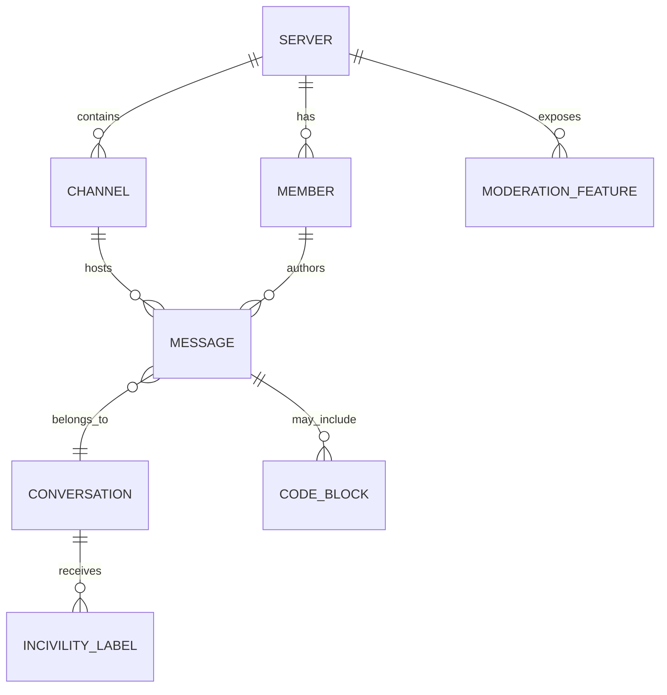

# Discord, incivilidades e engenharia de software

## Resumo executivo

A literatura levantada mostra com bastante consistência que o Discord já deixou de ser apenas uma plataforma “adjacente” e passou a funcionar, em várias comunidades de desenvolvimento, como infraestrutura de suporte técnico, coordenação, documentação viva, recuperação de conhecimento e interação com bots. Em Engenharia de Software, isso aparece de forma direta em trabalhos sobre datasets de conversas, visualização de comunidades, apoio à compreensão de programas, reúso de respostas passadas e bots de recomendação de especialistas; em paralelo, o artigo **Discord Unveiled** demonstra, em escala muito maior, que a coleta de dados públicos do Discord é tecnicamente viável e que a plataforma é rica para estudar governança, moderação, bots e dinâmicas comunitárias. citeturn26search7turn24view0turn21search3turn27search0turn45search5turn17view1

Ao mesmo tempo, a literatura sobre **incivilidade, toxicidade, assédio e conflito interpessoal** em Engenharia de Software é hoje robusta, sobretudo em **code review**, **issues** e **discussões em plataformas abertas**. Os principais efeitos observados não são marginais: há evidência de frustração, estresse, desmotivação, piora da colaboração, impacto negativo sobre a experiência de review, risco para inclusão e possível efeito sobre retenção de contribuidores. A evidência é particularmente forte em trabalhos sobre incivilidade em revisões da LKML, conflitos interpessoais em code review, críticas destrutivas e conflitos em issues e review discussions. citeturn39view0turn41search2turn42search1turn42search3turn4search4turn43search13turn4search3turn5search15

O ponto mais importante para o seu mestrado é a **lacuna**: nesta revisão, os estudos primários de Engenharia de Software encontrados sobre Discord concentram-se em **dados, documentação, busca de conhecimento, visualização, suporte e bots**, enquanto os estudos sobre incivilidade concentram-se em **GitHub, LKML, code review, issues, Gitter e Stack Overflow**. Em outras palavras, a interseção “**Discord + incivilidade em comunidades de desenvolvimento**” aparece como um espaço ainda pouco explorado na literatura principal de SE — e, justamente por isso, com forte potencial de contribuição científica. citeturn24view0turn26search7turn21search3turn27search0turn45search5turn39view0turn41search2turn42search1turn43search13

A melhor formulação de tese, a partir do corpus analisado, é: **Discord é importante para a Engenharia de Software porque concentra colaboração, suporte, documentação informal e integração com bots; porém, por ser uma plataforma síncrona, densa e comunitária, ele também pode reproduzir — ou intensificar — formas de incivilidade já observadas em outras arenas socio­técnicas do desenvolvimento de software.** O desenho metodológico mais promissor é uma coleta **consentida**, com bot próprio e uso das APIs oficiais, combinada com **disentanglement**, anotação manual de incivilidade e modelagem quantitativa do impacto em resolução, tempo de resposta e permanência de participantes. citeturn17view1turn27search0turn12view0turn14search1turn14search4turn16search0turn15view0turn15view1

## Discord como infraestrutura de trabalho em Engenharia de Software

Os trabalhos mais relevantes encontrados mostram uma trajetória clara: a comunidade de SE foi primeiro aprendendo a minerar **Slack** e **Gitter**, e depois passou a tratar o **Discord** como fonte própria de conhecimento. O argumento recorrente é que chats de desenvolvimento são fontes valiosas, mas difíceis de explorar, porque são **de alto volume**, **altamente voláteis** e frequentemente **entrelançam múltiplas conversas** no mesmo canal. No caso do Discord, Raglianti e coautores são especialmente explícitos: muitos projetos em GitHub já adotam o Discord como ferramenta primária de comunicação, mas a informação ali compartilhada é frágil e demanda mecanismos de persistência, reconstrução e busca semântica. citeturn35search1turn35search3turn33view0turn34view0turn24view0

O estudo **DISCO** é central porque oferece uma base de dados explicitamente pensada para pesquisa em SE: um ano de conversas públicas de quatro comunidades de desenvolvimento — **Python, Go, Clojure e Racket** — extraídas de canais de programação/Q&A, com aplicação de técnica de disentanglement e validação manual em uma amostra de 500 conversas. Isso é importante não só como material empírico, mas como prova de viabilidade metodológica para investigar Discord em comunidades de software. citeturn26search7turn26search4

No nível de instrumentação e análise, o artigo **Using Discord Conversations as Program Comprehension Aid** mostra por que o Discord importa para tarefas clássicas de Engenharia de Software. Os autores propõem reconstruir conversas, separar linguagem natural de blocos de código, mapear classes e métodos mencionados, e transformar o histórico do servidor em uma camada adicional de documentação para apoio à compreensão de programas. O paper argumenta que essas conversas são parte integrante da “documentation landscape” e que seu valor está justamente em preservar e tornar reutilizável um conhecimento que, de outro modo, se perde no fluxo do chat. citeturn24view0

No mesmo eixo, **DiscOrDance** e o trabalho precursor **Visualizing Discord Servers** tratam o servidor Discord como objeto de visual analytics para manutenção e evolução de software. A ênfase aqui é menos “qual dado existe” e mais “como tornar o histórico inteligível para humanos”, oferecendo múltiplas visões de atividade por canal, autores e código compartilhado. Para o seu mestrado, isso é relevante porque sugere que incivilidade em Discord não precisa ser estudada só como classificação textual de mensagem; ela pode ser analisada como propriedade de **conversas**, **canais**, **subcomunidades**, **papéis** e **temporalidades**. citeturn21search3turn21search4turn21search23

Já **Conversation Disentanglement As-a-Service** reforça um ponto metodológico crucial: antes de medir incivilidade em chats massivos, é preciso resolver a estrutura conversacional. O trabalho apresenta o **CODI** como serviço para disentanglement em plataformas como **IRC, Slack e Discord**, com foco em reprodutibilidade e reuso de resultados. Em um estudo sobre incivilidade, isso é decisivo, porque o fenômeno raramente se esgota em uma mensagem isolada; ele costuma depender da sequência de turnos, de quem responde a quem, da escalada e da resolução — ou não — do conflito. citeturn27search0turn27search1

Outro paper especialmente útil é **On the Helpfulness of Answering Developer Questions on Discord with Similar Conversations and Posts from the Past**, do **ICSE 2024**. O estudo realizou um experimento de campo com **277 perguntas** em **quatro comunidades Discord** e mostrou que sugerir conversas passadas pode ser útil, embora apenas **40%** dos desenvolvedores tenham considerado as sugestões úteis; além disso, posts do **Stack Overflow** foram mais frequentemente considerados úteis do que conversas anteriores do próprio Discord. Essa é uma evidência muito valiosa para a sua narrativa: o Discord é importante, mas sua utilidade como repositório de conhecimento é mais difícil de operacionalizar do que em plataformas mais estruturadas. citeturn23search2turn45search5turn45search10

Por fim, há também evidência de que o Discord não é só um espaço de conversa, mas um espaço de **automação**. O paper sobre **expert retrieval bot** na comunidade Pharo mostra o uso de embeddings e históricos conversacionais para recomendar especialistas, enquanto o próprio **Discord Unveiled** destaca o papel central de bots na estruturação e gestão dos servidores. Isso sustenta uma hipótese importante para o seu trabalho: em Discord, incivilidade não é apenas um fenômeno “entre pessoas”, mas potencialmente um fenômeno moldado por **moderation bots**, **onboarding**, **regras do servidor** e **papéis comunitários**. citeturn36search6turn17view1

### Referências acadêmicas sobre Discord em comunidades de desenvolvimento

| Referência                                                                                                                                                                           |  Ano | Venue              | Foco                                                             | Métodos                                                                                    | Principais achados                                                                                            | Relevância para o mestrado                                                      |
| ------------------------------------------------------------------------------------------------------------------------------------------------------------------------------------ | ---: | ------------------ | ---------------------------------------------------------------- | ------------------------------------------------------------------------------------------ | ------------------------------------------------------------------------------------------------------------- | ------------------------------------------------------------------------------- |
| Subash et al., **DISCO: A Dataset of Discord Chat Conversations for Software Engineering Research** citeturn26search7turn26search4                                               | 2022 | **MSR**            | Dataset de conversas Discord em comunidades de software          | Coleta de um ano em quatro comunidades; disentanglement; validação manual de 500 conversas | Mostra viabilidade de mineração de Discord para SE e cria base reutilizável para Q&A, sumarização e bots      | Excelente precedente metodológico para coleta de dados e construção do corpus   |
| Raglianti et al., **Using Discord Conversations as Program Comprehension Aid** citeturn24view0                                                                                    | 2022 | **ICPC**           | Discord como documentação informal para compreensão de programas | Reconstrução de conversas; separação linguagem natural/código; mapeamento de artefatos     | Trata Discord como documentação crowd-sourced, valiosa e volátil; propõe persistência e recuperação semântica | Fundamenta a tese de que Discord é relevante para SE além de “chat casual”      |
| Raglianti et al., **DiscOrDance: Visualizing Software Developers Communities on Discord** citeturn21search3turn21search4                                                         | 2022 | **ICSME**          | Visual analytics de comunidades de desenvolvimento no Discord    | Modelagem do histórico como grafo e visualizações de canais, autores e código              | Torna o histórico do servidor explorável para manutenção/evolução                                             | Útil para pensar incivilidade como fenômeno estrutural e temporal               |
| Riggio et al., **Conversation Disentanglement As-a-Service** citeturn27search0turn27search1                                                                                      | 2023 | **ICPC**           | Disentanglement de conversas em IRC/Slack/Discord                | Serviço/microserviço para reconstrução de conversas                                        | Reprodutibilidade e redução do esforço na separação de threads                                                | Ferramental quase obrigatório para estudar incivilidade em canais de alto fluxo |
| Lill et al., **On the Helpfulness of Answering Developer Questions on Discord with Similar Conversations and Posts from the Past** citeturn23search2turn45search5turn45search10 | 2024 | **ICSE**           | Reúso de conhecimento prévio para responder perguntas no Discord | Experimento de campo com 277 perguntas em quatro comunidades                               | 40% acharam as sugestões úteis; Stack Overflow foi mais útil do que histórico do Discord em muitos casos      | Mostra tanto o valor quanto a limitação do Discord como base de conhecimento    |
| Norambuena e Bergel, **Building a Bot for Automatic Expert Retrieval on Discord** citeturn36search6turn36search2                                                                 | 2021 | MaLTeSQuE Workshop | Bot para recomendação de especialistas em comunidade de software | Bot com embeddings e avaliação preliminar                                                  | Pelo menos metade dos usuários recuperados eram de fato especialistas                                         | Sustenta o eixo “Discord + bots + colaboração” do seu enquadramento             |
| Raglianti, **Topology of the Documentation Landscape** citeturn38search2turn38search9                                                                                            | 2022 | **ICSE Companion** | Agenda de pesquisa sobre documentação moderna                    | Position/research agenda                                                                   | Propõe incorporar Discord e outras fontes instantâneas na paisagem de documentação                            | Dá respaldo conceitual para tratar Discord como documentação socio­técnica      |
| Aquino et al., **Discord Unveiled: A Comprehensive Dataset of Public Communication** citeturn17view1                                                                              | 2025 | arXiv              | Dataset geral de servidores públicos do Discord                  | 2,05 bilhões de mensagens; 4,74 milhões de usuários; 3.167 servidores; anonimização        | Mostra escala, diversidade, papel de bots e viabilidade ética/técnica de coleta pública                       | Não é paper de SE, mas é a melhor base para justificar o plano de extração      |

## Incivilidades em Engenharia de Software e seus efeitos

A literatura de incivilidade em SE já é suficientemente madura para sustentar uma narrativa forte. O paper mais influente da amostra, **The “Shut the f**k up” Phenomenon**, usa o conceito de incivilidade como lente analítica para discutir revisões de patches rejeitados na **Linux Kernel Mailing List**. O estudo analisou **1.545 e-mails** e identificou **16 tone-bearing discussion features**, entre elas sete traços incivis, como **bitter frustration, impatience, irony, mocking, name calling, threat** e **vulgarity**. O resultado mais forte é que **66,66% dos e-mails não técnicos\*\* continham traços incivis. O artigo também associa esse ambiente a barreiras de onboarding e a desgaste dos participantes. citeturn39view0

Esse diagnóstico conversa diretamente com a literatura sobre **conflitos interpessoais em code review**. Em **Interpersonal Conflicts During Code Review**, os autores mostram, por meio de análise temática de entrevistas com 22 desenvolvedores, que conflitos em revisão são percebidos como comuns e até “normais”, mas têm impacto negativo sobre a revisão quando mal conduzidos; ao mesmo tempo, se resolvidos construtivamente, podem gerar valor e melhoria. A contribuição importante aqui é a noção de que o problema não é simplesmente “discordar”, mas a forma como a discordância é conduzida no contexto sócio-técnico do review. citeturn41search2

O follow-up mais aplicado, **Constructive Code Review: Managing the Impact of Interpersonal Conflicts in Practice**, reforça o peso prático do fenômeno. Com **154 respondentes**, o estudo encontrou que **77%** dos desenvolvedores às vezes passam por conflitos interpessoais em code review, e que para **64%** isso representa algum grau de problema para o trabalho. O paper também mostra que muitos profissionais lidam com o problema de forma individual ou evitativa, o que sugere ausência de mecanismos organizacionais maduros para prevenir ou mitigar incivilidade. citeturn4search4turn4search14

A dimensão de **inclusão e retenção** aparece com força em **Destructive Criticism in Software Code Review Impacts Inclusion**. O estudo conclui que crítica destrutiva em review tem efeito mais negativo sobre mulheres, que a percebem como menos apropriada e se mostram menos motivadas a continuar trabalhando com a pessoa que a produziu; além disso, a exposição a feedback negativo inespecífico e inconsiderado é frequente. Isso é altamente relevante para o seu mestrado porque desloca o tema de “tom de conversa” para “sustentabilidade da comunidade”. citeturn42search1turn42search3

A literatura também começa a migrar de **caracterização** para **detecção** e **intervenção**. Em **Detecting Interpersonal Conflict in Issues and Code Review**, os autores estudam se classificadores de toxicidade e pushback generalizam entre contextos abertos e fechados, mostrando que conflito interpessoal pode ser detectado em discussões de issues e review. Já **Incivility Detection in Open Source Code Review and Issue Discussions** desloca o problema para modelagem supervisionada, comparando seis modelos clássicos e BERT para detectar incivilidade em code review e issues. Em conjunto, esses trabalhos mostram que já há base para um pipeline de anotação e predição aplicável ao Discord. citeturn43search13turn4search3turn4search27

Além do code review, há forte evidência em **GitHub issues**. **How Heated Is It? Understanding GitHub Locked Issues**, no **MSR 2022**, usa issues bloqueadas como janela para discussões consideradas “aquecidas”, enquanto **A Comprehensive Annotated Dataset of Locked GitHub Issue Discussions**, no **MSR 2024**, oferece um dataset anotado que identifica formas recorrentes de incivilidade, como frustração amarga, impaciência e deboche. Isso é importante porque desloca a agenda de incivilidade para espaços conversacionais mais próximos de canais de ajuda e suporte — justamente onde Discord costuma ser mais usado em comunidades de desenvolvimento. citeturn5search15turn5search3turn5search2turn5search8

A agenda mais recente amplia o escopo: o paper **Do Words Have Power? Understanding and Fostering Civility in Code Review Discussion**, no **FSE 2024**, já parte da necessidade de **promover civilidade** e não só caracterizar problemas; e estudos recentes sobre GitHub e bug reports mostram que a investigação de toxicidade está se expandindo para outros artefatos e etapas do desenvolvimento. A evidência, porém, ainda é mais forte para impactos em **colaboração, motivação, estresse, inclusão e experiência de trabalho** do que para uma ligação causal direta e forte com **qualidade do código**. Para o seu texto, essa nuance é importante: a relação com qualidade existe, mas o nexo empírico mais sólido hoje passa primeiro por fatores humanos e organizacionais. citeturn5search4turn43search10turn6search11turn6search3

### Referências acadêmicas sobre incivilidade, toxicidade e conflito em SE

| Referência                                                                                                                                                |  Ano | Venue                               | Foco                                               | Métodos                                                                           | Principais achados                                                                                                  | Relevância para o mestrado                                    |
| --------------------------------------------------------------------------------------------------------------------------------------------------------- | ---: | ----------------------------------- | -------------------------------------------------- | --------------------------------------------------------------------------------- | ------------------------------------------------------------------------------------------------------------------- | ------------------------------------------------------------- |
| Ferreira et al., **The “Shut the f**k up” Phenomenon: Characterizing Incivility in Open Source Code Review Discussions\*\* citeturn39view0turn39view1 | 2021 | **CSCW / PACM HCI**                 | Incivilidade em code review OSS                    | Qualitativo em 1.545 e-mails da LKML                                              | 16 traços discursivos; 66,66% dos e-mails não técnicos continham traços incivis; barreiras de onboarding e desgaste | Base conceitual mais forte para definir incivilidade          |
| Wurzel Gonçalves et al., **Interpersonal Conflicts During Code Review** citeturn41search2turn41search11                                               | 2022 | **CSCW / PACM HCI**                 | Conflitos interpessoais em revisão                 | Entrevistas com 22 desenvolvedores; análise temática                              | Conflitos são comuns, normais e podem prejudicar a revisão; quando bem resolvidos, podem gerar valor                | Excelente ponte entre “discordância técnica” e “incivilidade” |
| Qiu et al., **Detecting Interpersonal Conflict in Issues and Code Review** citeturn43search13turn43search1                                            | 2022 | **ICSE-SEIS**                       | Detecção automática de conflito interpessoal       | Avaliação cruzada entre classificadores de toxicidade/pushback em issues e review | Mostra viabilidade de detectar conflito em diferentes contextos de colaboração                                      | Base metodológica para classificação em Discord               |
| Ferreira et al., **How Heated Is It? Understanding GitHub Locked Issues** citeturn5search15turn5search3                                               | 2022 | **MSR**                             | Discussões “aquecidas” em GitHub issues bloqueadas | Estudo empírico sobre locked issues                                               | Issues bloqueadas funcionam como janela analítica para conflitos e calor conversacional                             | Fortemente comparável a canais públicos de suporte no Discord |
| Gunawardena et al., **Destructive Criticism in Software Code Review Impacts Inclusion** citeturn42search1turn42search3                                | 2022 | **CSCW / PACM HCI**                 | Crítica destrutiva, emoção e inclusão              | Estudo empírico com cenários e respostas de desenvolvedores                       | Crítica destrutiva reduz motivação; efeito mais forte sobre mulheres; risco para inclusão                           | Sustenta a dimensão “retenção e diversidade” do seu argumento |
| Ferreira et al., **Incivility Detection in Open Source Code Review and Issue Discussions** citeturn4search3turn4search27                              | 2024 | **Journal of Systems and Software** | Detecção automática de incivilidade                | Comparação de 6 modelos clássicos com BERT                                        | Consolida a agenda de classificação supervisionada em SE                                                            | Útil para definir baseline de modelos no Discord              |
| Wurzel Gonçalves et al., **Constructive Code Review: Managing the Impact of Interpersonal Conflicts in Practice** citeturn4search4turn4search14       | 2024 | **ICSE-SEIP**                       | Gestão prática de conflitos em revisão             | Survey com 154 respondentes                                                       | 77% vivenciam conflitos às vezes; 64% relatam algum impacto problemático no trabalho                                | Forte evidência aplicada do custo prático de conflitos        |
| Rahman et al., **Do Words Have Power? Understanding and Fostering Civility in Code Review Discussion** citeturn43search6turn43search10                | 2024 | **FSE / Proc. ACM Softw. Eng.**     | Promoção de civilidade em code review              | Estudo empírico com foco em linguagem e intervenção                               | Move a agenda de “detectar” para “fomentar civilidade”                                                              | Importante para justificar uma tese orientada a intervenção   |
| Ehsani et al., **A Comprehensive Annotated Dataset of Locked GitHub Issue Discussions** citeturn5search2turn5search8                                  | 2024 | **MSR**                             | Dataset anotado de incivilidade em issues          | Curadoria e anotação de discussões bloqueadas                                     | Bitter frustration, impatience e mocking emergem como formas prevalentes de incivilidade                            | Muito útil como ontologia comparável para rotular Discord     |

## Onde as duas agendas se encontram

A síntese do corpus sugere um quadro claro. Nos estudos de Discord em SE, o foco recai sobre **mineração de conversas**, **documentação informal**, **busca e reutilização de conhecimento**, **visualização de comunidades** e **bots**. Nos estudos de incivilidade em SE, o foco recai sobre **code review**, **issue discussions**, **GitHub** e, em menor medida, ambientes como **Gitter** e **Stack Overflow**. Nesta revisão, **não identifiquei um estudo primário, em venues centrais de SE, cujo objeto principal seja incivilidade em comunidades de desenvolvimento no Discord**. Essa ausência, no entanto, não enfraquece sua proposta; ao contrário, ela a fortalece como lacuna de pesquisa. citeturn24view0turn26search7turn21search3turn27search0turn45search5turn39view0turn43search13turn42search1

O motivo pelo qual a transferência de hipóteses faz sentido é estrutural. Discord, Slack e Gitter são todos ambientes de **chat síncrono ou quase síncrono**, com sobreposição de tópicos, forte dependência de contexto conversacional e dinâmica comunitária rápida. A literatura em Slack/Gitter já demonstrou a relevância de disentanglement, qualidade de conversas, padrões de resposta, tópicos recorrentes e FAQs; a literatura de incivilidade em GitHub e code review mostrou que conflito e linguagem desrespeitosa afetam a experiência de colaboração e podem ser modelados. O próximo passo lógico é unir essas duas trilhas em Discord. citeturn35search1turn35search3turn35search2turn33view0turn34view0turn30view0turn39view0turn43search13

Há ainda um segundo motivo forte: o **Discord difere das plataformas já estudadas** em aspectos potencialmente decisivos para incivilidade. A plataforma organiza interação por **servidores**, **canais por tópico**, regras de onboarding, **rules screening**, papéis, bots e ferramentas de moderação voltadas a comunidades; a documentação oficial também destaca Community Servers com recursos adicionais como insights, proteção contra raids e onboarding. Isso significa que, em Discord, a incivilidade pode ser analisada não só no nível de mensagens, mas como fenômeno dependente de **design comunitário**, **controles de entrada**, **presença de moderação** e **ecologia de canais**. citeturn13search10turn13search21turn13search18turn18search8

### Estudos comparáveis em outras plataformas que ajudam a desenhar a pesquisa

| Referência                                                                                                                                      |  Ano | Venue        | Plataforma | O que ensina para um estudo futuro sobre Discord                                                              | Relevância para o mestrado                                      |
| ----------------------------------------------------------------------------------------------------------------------------------------------- | ---: | ------------ | ---------- | ------------------------------------------------------------------------------------------------------------- | --------------------------------------------------------------- |
| Chatterjee et al., **Exploratory Study of Slack Q&A Chats as a Mining Source for Software Engineering Tools** citeturn35search1turn9search1 | 2019 | **MSR**      | Slack      | Chats de Q&A são fonte minerável, mas exigem tratamento do formato conversacional                             | Precedente metodológico para suporte técnico em chat            |
| Chatterjee et al., **Software-Related Slack Chats with Disentangled Conversations** citeturn35search3turn8search4                           | 2020 | **MSR**      | Slack      | Disentanglement é etapa essencial para analisar conhecimento em canais de chat                                | Muito transferível para Discord                                 |
| Chatterjee et al., **Automatically Identifying the Quality of Developer Chats for Post Hoc Use** citeturn35search2turn9search21             | 2021 | **TOSEM**    | Slack      | Qualidade pós-hoc de conversas pode ser prevista automaticamente                                              | Pode ser combinada com métricas de incivilidade                 |
| Ehsan et al., **An Empirical Study of Developer Discussions in the Gitter Platform** citeturn33view0                                         | 2020 | **TOSEM**    | Gitter     | Threads identificáveis, resolução, tópicos recorrentes, links externos e FAQs emergem naturalmente            | Ajuda a operacionalizar efeitos de incivilidade sobre resolução |
| Shi et al., **A First Look at Developers’ Live Chat on Gitter** citeturn34view0                                                              | 2021 | **ESEC/FSE** | Gitter     | Perfil temporal, estruturas de comunidade, tópicos e padrões de interação podem ser extraídos em larga escala | Excelente molde analítico para servidores Discord               |

A consequência analítica dessa ponte é importante: **se o Discord já é uma infraestrutura de suporte e documentação informal para comunidades de software, e se incivilidade já se mostrou nociva em outras arenas de colaboração de software, então investigar incivilidade em Discord não é um desvio de tema — é o próximo passo natural da agenda de SE sobre comunicação e comunidades**. Essa inferência é suportada pelo corpus, embora ainda não tenha sido completamente testada por um paper focalizado especificamente no Discord. citeturn24view0turn26search7turn45search5turn39view0turn42search1turn43search13

## Proposta de extração e análise de dados do Discord

A recomendação metodológica mais segura e academicamente defensável é **não depender de scraping oportunístico do ecossistema público**, mas sim de **coleta consentida, via APIs oficiais e bot de pesquisa**, em servidores-alvo de comunidades de desenvolvimento. Isso reduz risco jurídico, melhora a qualidade dos metadados e alinha o estudo às restrições atuais do Discord sobre conteúdo de mensagens, intents privilegiadas e rate limiting. O próprio **Discord Unveiled** prova que a coleta de dados públicos em larga escala é viável e pode ser anonimizada; porém, para um estudo de mestrado focado em incivilidade em comunidades de software, a estratégia consentida é metodologicamente melhor. citeturn17view1turn15view0turn15view1turn16search0turn12view0

```mermaid
flowchart LR
    A[Seleção de servidores de desenvolvimento] --> B[Contato com admins e consentimento]
    B --> C[Cadastro de app/bot no Discord]
    C --> D[Coleta via REST e Gateway]
    D --> E[Mensagens, canais, papéis e metadados]
    E --> F[Anonimização e minimização]
    F --> G[Separação NL e código]
    G --> H[Disentanglement de conversas]
    H --> I[Anotação de incivilidade e conflito]
    I --> J[Métricas de resolução, tempo e retenção]
    J --> K[Modelagem estatística e análise comparativa]
```

### Desenho recomendado do corpus

Como o tamanho do corpus e os servidores-alvo não foram especificados, eu recomendaria um desenho em duas etapas. Na **fase piloto**, 2–3 servidores de comunidades de software com histórico de canais de suporte/Q&A, para validar pipeline, taxonomia e taxa de concordância entre anotadores. Na **fase principal**, 8–12 servidores, cobrindo ecossistemas distintos — por exemplo, linguagens, frameworks, ferramentas e servidores de projetos ou comunidades de aprendizagem. Essa faixa é realista para um mestrado e suficientemente rica para comparações entre tipos de comunidade. A ordem de grandeza esperada é de **centenas de milhares a alguns milhões de mensagens**, com forte heterogeneidade; isso é uma **inferência** razoável a partir da escala e variabilidade observadas em **DISCO** e em **Discord Unveiled**, não um valor diretamente reportado por um único paper. citeturn26search7turn17view1

### Classificação de canais de software

Uma diferença metodológica importante é que **canal não é conversa** e **servidor de software não implica canal de software**. Um servidor de projeto OSS pode ter canais centrais como `#help`, `#bug-reports` e `#development`, mas também canais sociais ou administrativos como `#memes`, `#off-topic`, `#roles` e `#rules`. Portanto, a unidade de inclusão da amostra deve ser: **servidor válido de SE/OSS + canal textual válido de software dentro desse servidor**.

Neste trabalho, um canal de software pode ser definido operacionalmente como um canal textual de um servidor Discord cuja finalidade predominante é apoiar atividades relacionadas ao desenvolvimento, manutenção, uso, evolução, suporte, documentação, depuração, contribuição ou governança de software, especialmente em projetos, ferramentas, linguagens, frameworks ou ecossistemas open source. Essa definição inclui dúvidas técnicas, bugs, instalação e configuração, APIs, desenvolvimento, releases, documentação, troubleshooting, arquitetura, revisão de código e integração com GitHub/GitLab; e exclui memes, off-topic, regras, cargos, moderação interna, bots, voz, spam, marketplace e vagas, salvo se mercado de trabalho for uma dimensão explícita do estudo.

Keywords de canais devem ser usadas apenas como filtro inicial. O DISCO mostra que canais chamados `#general` podem ter função técnica clara, como em comunidades de programação, enquanto nomes aparentemente técnicos podem ter pouco conteúdo de engenharia de software. Por isso, a classificação dos canais deve combinar metadados, evidências lexicais no conteúdo, evidências de OSS e modelagem semântica de tópicos. Um desenho defensável é: primeiro selecionar servidores candidatos; depois extrair canais textuais; remover bots, regras, logs e off-topic evidente; calcular sinais técnicos como links para repositórios, menções a issues/PRs, comandos, extensões de arquivos, stack traces e termos de manutenção; aplicar embeddings/SBERT e BERTopic em blocos temporais ou blocos de mensagens; classificar canais em A/B/C/D; e validar manualmente uma amostra estratificada.

As classes recomendadas são: **A — canal técnico central**, para dúvidas, suporte, bugs, desenvolvimento, código, API e contribuição; **B — canal técnico periférico**, para releases, documentação, anúncios técnicos e roadmap; **C — canal social/comunitário**, para off-topic, memes, apresentações e eventos; e **D — canal administrativo/bot**, para logs, regras, moderação, bots, cargos e voz. Para a análise principal, a escolha mais limpa é focar na classe A e usar a classe B apenas em análise secundária ou comparação.

O índice metodológico completo pode ser formulado como `SoftwareChannelScore = 0.25 * MetadataScore + 0.25 * LexicalEvidenceScore + 0.35 * SemanticTopicScore + 0.15 * OSSEvidenceScore`, com `>= 0.70` indicando canal técnico, `0.50–0.69` indicando caso ambíguo para validação manual e `< 0.50` indicando exclusão. Os pesos podem ser ajustados após piloto, desde que o critério seja explícito. A sumarização automática pode apoiar avaliadores humanos, mas não deve substituir os critérios objetivos e a validação manual.

O disentanglement não precisa ser requisito para selecionar canais. Para essa etapa, agregações por canal, blocos temporais ou blocos de N mensagens são suficientes. O disentanglement se torna mais importante depois, quando a análise de incivilidade depender de contexto conversacional: quem respondeu a quem, se uma conversa foi abandonada, se uma dúvida técnica virou conflito ou se newcomers receberam respostas hostis.

### Ferramentas, APIs e restrições que importam

A documentação oficial do Discord estabelece que bots e apps usem a **Developer Platform** e respeitem **rate limits** dinâmicos; esses limites não devem ser hardcoded, pois variam por rota e por recurso. A documentação também registra um **limite global de 50 requisições por segundo por bot** e um limite de **10.000 requisições inválidas em 10 minutos** para evitar bloqueios temporários. Para um estudo acadêmico, isso implica filas, backoff e logging fino da coleta. citeturn14search17turn12view0

Além disso, o Discord tornou o **Message Content Intent** um **intent privilegiado** para apps verificados, e a política de revisão informa que bots com operação em **mais de 100 servidores** precisam de aprovação para acessar conteúdo em escala; sem a permissão, campos como `content`, `embeds`, `attachments` e `components` podem vir vazios. Também há restrições específicas para listar membros de um servidor, o que depende do **GUILD_MEMBERS Privileged Intent**. Na prática, isso favorece um estudo com **menos de 100 servidores na coleta principal** ou com submissão formal para revisão do intent, caso você queira escalar além disso. citeturn14search1turn14search4turn14search13turn16search0

As mudanças recentes na UX pública também importam. O antigo “Server Discovery” aparece na documentação de suporte como experimento encerrado, mas a aba **Discover/Servers** continua oferecendo acesso a **Community Servers** e a visualização prévia (“lurker mode”) de canais públicos em alguns contextos. Isso significa que a estratégia de amostragem por descoberta pública ainda é conceitualmente possível, mas não deve ser assumida como estável nem suficiente para um desenho longitudinal robusto. Novamente, isso reforça a escolha por **servidores consentidos**. citeturn18search2turn18search8turn13search21

### Plano operacional proposto

| Componente          | Proposta concreta                                                                                                   | Justificativa                                                                                                                               |
| ------------------- | ------------------------------------------------------------------------------------------------------------------- | ------------------------------------------------------------------------------------------------------------------------------------------- |
| Servidores-alvo     | 8–12 servidores públicos/comunitários de desenvolvimento, com foco em suporte, Q&A e colaboração                    | Garante variação entre ecossistemas e viabilidade para mestrado citeturn26search7turn17view1                                            |
| Forma de acesso     | Bot de pesquisa com consentimento dos admins; coleta via APIs oficiais                                              | Alinha-se a termos, intents e ética do Discord citeturn15view0turn15view1turn16search0                                                 |
| Janela temporal     | 12 meses para estudo principal; 2–3 meses para piloto                                                               | Equilíbrio entre longitudinalidade e viabilidade analítica                                                                                  |
| Unidades de análise | servidor candidato, canal técnico classificado, conversa disentangled, mensagem, participante pseudonimizado        | A seleção temática deve ocorrer no nível de canal; incivilidade em chat depende de contexto conversacional citeturn27search0turn24view0 |
| Pré-processamento   | remoção/rotulagem de bots; separação NL/código; normalização; language ID; disentanglement                          | Baseado em literatura de Discord, Slack e Gitter citeturn24view0turn27search0turn35search3turn33view0                                 |
| Anotação            | Taxonomia inicial com os traços de Ferreira et al.; dupla anotação em amostra estratificada                         | Aproveita a taxonomia de incivilidade já consolidada citeturn39view0                                                                     |
| Variáveis de efeito | resolução, tempo até primeira resposta, duração da conversa, abandono, retorno do usuário, necessidade de moderação | Conecta incivilidade a impacto concreto em SE citeturn33view0turn34view0turn4search4turn42search1                                     |
| Comparação externa  | vincular, quando possível, conversas que referenciem GitHub/Stack Overflow                                          | Permite comparar Discord com ecossistemas já estudados citeturn45search5turn35search1turn5search15                                     |

### Pré-processamento e modelagem

O pipeline técnico deveria tratar o Discord como artefato híbrido: há texto, código, respostas curtas, mensagens de bot, links para GitHub/Stack Overflow e, às vezes, imagens ou anexos. Seguindo a literatura já existente, eu sugiro pelo menos seis passos de pré-processamento: **pseudonimização**, **rotulagem de bots**, **separação de linguagem natural e código**, **detecção de idioma**, **disentanglement** e **vinculação de artefatos externos**. A separação NL/código já foi proposta no contexto de compreensão de programas; o disentanglement é explicitamente defendido por CODI e pela literatura de Slack/Gitter; e a recuperação de conhecimento passado em Discord depende fortemente de reconstruir conversas coerentes. citeturn24view0turn27search0turn35search3turn33view0turn45search5

As métricas de incivilidade devem operar em **dois níveis**. No nível de **mensagem**, vale rotular presença/ausência e tipo de traço, com base na taxonomia de Ferreira et al. No nível de **conversa**, vale medir: proporção de mensagens incivis; existência de escalada; alvo provável da incivilidade; posição do evento incivil na conversa; e se houve resolução, silêncio, dispersão ou intervenção de moderador/bot. Com isso, você poderá testar hipóteses como “conversas com evento incivil têm menor taxa de resolução” ou “novatos expostos a incivilidade retornam menos ao servidor”. citeturn39view0turn43search13turn42search1turn33view0

### Métricas recomendadas de incivilidade e impacto

Eu recomendaria medir, no mínimo, os seguintes indicadores:

- **Prevalência**: mensagens incivis por 1.000 mensagens; conversas com ao menos um evento incivil; distribuição por canal, tema e horário.
- **Severidade discursiva**: frustração, impaciência, ironia, deboche, xingamento, ameaça, vulgaridade, além de conflito/pushback quando útil. citeturn39view0turn43search13
- **Impacto operacional**: tempo até primeira resposta, tempo até solução, taxa de resolução, número de turnos, necessidade de intervenção. citeturn33view0turn34view0
- **Impacto comunitário**: retorno do usuário em 30/90 dias, persistência após primeiro episódio de incivilidade, diferença entre novatos e veteranos. Isso é uma extensão proposta a partir da literatura de inclusão, conflito e onboarding. citeturn42search1turn39view0turn4search4
- **Fatores explicativos**: presença de onboarding/rules screening, canais especializados, bots de moderação, volume do canal, proporção de bots, momento da semana e densidade do fluxo. citeturn13search10turn13search21turn17view1

### Ética, conformidade e limitações

Do ponto de vista ético, a estratégia recomendada é: **aprovação em CEP/IRB**, consentimento de administradores, aviso público de pesquisa no servidor, escopo limitado a canais públicos e relevantes, exclusão de DMs e canais sensíveis, anonimização forte de IDs e ausência de redistribuição de texto bruto do corpus. Isso é coerente tanto com as boas práticas do paper **Discord Unveiled** quanto com a ênfase do próprio Discord em privacidade, segurança, developer policy e community guidelines. citeturn17view1turn15view0turn15view1turn15view2turn15view3

As limitações principais são quatro. A primeira é técnica: intents privilegiadas restringem coleta em escala, especialmente de conteúdo e listas de membros. A segunda é ecológica: nem toda comunidade relevante em SE é pública, e muitos comportamentos tóxicos podem migrar para espaços privados, voz ou DMs. A terceira é inferencial: efeitos sobre “qualidade do código” são mais difíceis de estabelecer causalmente do que efeitos sobre resposta, resolução, permanência e interação. A quarta é histórica: a interface pública de descoberta de servidores evoluiu desde os estudos de 2022–2025, então desenhos que dependam demais da UX pública tendem a ser mais frágeis do que desenhos baseados em consentimento. citeturn16search0turn14search1turn14search13turn18search2turn18search8turn39view0turn42search1

## Lacunas, perguntas de pesquisa e venues de submissão

A principal lacuna é simples de formular e forte do ponto de vista científico: **a Engenharia de Software já reconheceu o Discord como ecossistema de conhecimento e colaboração, mas ainda não o estudou com profundidade como ecossistema de incivilidade**. O segundo vazio está no nível causal: já há bons estudos sobre incidência e caracterização de conflito em review/issues, mas menos estudos conectando eventos de incivilidade a **desfechos operacionais comparáveis** em chats, como resolução, tempo de resposta e persistência do participante. O terceiro vazio é sociotécnico: quase não há estudos integrando **arquitetura comunitária** — regras, bots, onboarding, moderação — às análises de conflito. citeturn24view0turn27search0turn45search5turn39view0turn43search13turn42search1turn13search10turn13search21

As perguntas de pesquisa mais promissoras, na minha avaliação, são as seguintes:

- **RQ-A**: Como a incivilidade se manifesta em comunidades Discord de desenvolvimento de software, em termos de frequência, forma discursiva e distribuição entre canais e tipos de servidor?
- **RQ-B**: Qual é a relação entre eventos de incivilidade e desfechos conversacionais em Discord, como tempo até resposta, taxa de resolução e duração da conversa?
- **RQ-C**: A exposição à incivilidade afeta a permanência de novatos, a recorrência de participação e a disposição em continuar interagindo na comunidade?
- **RQ-D**: Recursos comunitários — regras explícitas, onboarding, bots, moderação, canais especializados — estão associados a menor incidência ou menor severidade de incivilidade?
- **RQ-E**: Em ecossistemas que usam simultaneamente Discord e GitHub/Stack Overflow, as formas de conflito se repetem, se transformam ou se distribuem diferentemente entre as plataformas?

Essas perguntas estão bem alinhadas ao estado da arte porque articulam três correntes já maduras — mineração de chats, documentação informal e incivilidade em colaboração de software — sem simplesmente repetir nenhuma delas. citeturn35search1turn35search3turn33view0turn39view0turn43search13turn45search5

### Recomendações de venues para submissão

| Venue                        | Melhor encaixe                                                                                        | O que enfatizar                                                                                  |
| ---------------------------- | ----------------------------------------------------------------------------------------------------- | ------------------------------------------------------------------------------------------------ |
| **MSR**                      | Se o artigo girar em torno de coleta/mineração de corpus, anotação, modelos e datasets                | Dataset Discord, pipeline de disentanglement, tipologia de incivilidade, benchmark de detectores |
| **ICPC**                     | Se o argumento central for documentação informal, compreensão e recuperação de conhecimento           | Como incivilidade afeta compreensão, busca de ajuda e reutilização de conhecimento em chats      |
| **ICSME**                    | Se houver ferramenta, visual analytics ou enfoque em manutenção/evolução de comunidades               | Painéis de monitoramento, análises por canal, evolução temporal de conflito                      |
| **ICSE Research Track**      | Se o estudo trouxer contribuição conceitual e empírica forte sobre comunidades de software            | Discord como nova fronteira socio­técnica de colaboração e conflito                              |
| **ICSE-SEIS**                | Se o framing principal for impacto social/organizacional da incivilidade                              | Inclusão, sustentabilidade comunitária, bem-estar e governança                                   |
| **ICSE-SEIP**                | Se você obtiver participação de comunidades reais, admins ou maintainers e recomendações práticas     | Experiência aplicada, moderação e intervenção em comunidades reais                               |
| **FSE**                      | Se houver contribuição metodológica robusta e/ou proposta de intervenção automatizada para civilidade | Modelos, mecanismos de detecção/mitigação, desenho de bots ou nudges                             |
| **EMSE / TOSEM / TSE / JSS** | Versão estendida, com validade externa, ablação, estudos longitudinais e comparação entre plataformas | Artigo mais completo, com maior maturidade analítica e triangulação                              |

Se eu tivesse de ranquear o encaixe para o seu caso hoje, faria assim: **MSR** para um primeiro paper de corpus/anotação/mineração; **ICSE-SEIS** ou **ICSE Research** para um paper que una Discord, incivilidade e sustentabilidade da colaboração; e **EMSE** ou **TOSEM** para a versão estendida do trabalho. Essa recomendação decorre diretamente de como o corpus atual se distribui entre venues: Discord tem tração forte em **MSR, ICPC, ICSME, ICSE**, enquanto a agenda de conflito/incivilidade já dialoga bem com **ICSE, FSE, JSS** e venues socio­técnicos adjacentes. citeturn26search7turn24view0turn21search3turn45search5turn43search13turn4search4turn4search3

### Questões em aberto e limitações desta revisão

Esta revisão foi **profunda, mas não exaustiva no sentido bibliométrico**. A ausência de um paper “Discord + incivilidade em comunidades de software” deve ser lida como ausência **no corpus prioritário recuperado nesta investigação**, não como prova absoluta de inexistência mundial. Também houve alguns casos em que o texto completo de ACM/IEEE não estava diretamente acessível pelo navegador e precisei combinar fontes primárias acessíveis, páginas institucionais de autores e metadados de conferência para confirmar venue, resumo e achados principais. Ainda assim, o padrão geral emergiu com alta consistência: **Discord já é importante para a Engenharia de Software; incivilidade já é um problema demonstrado em SE; e a interseção entre ambos continua subexplorada e, por isso mesmo, promissora para pesquisa de mestrado.** citeturn45search10turn45search5turn24view0turn39view0turn42search1
