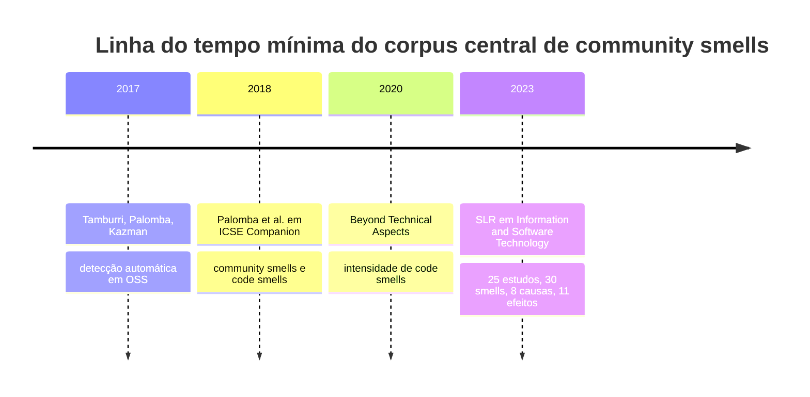
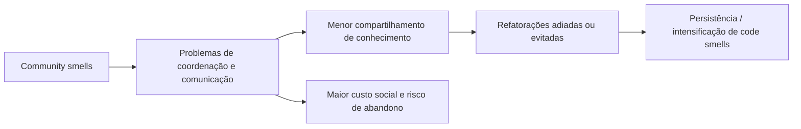
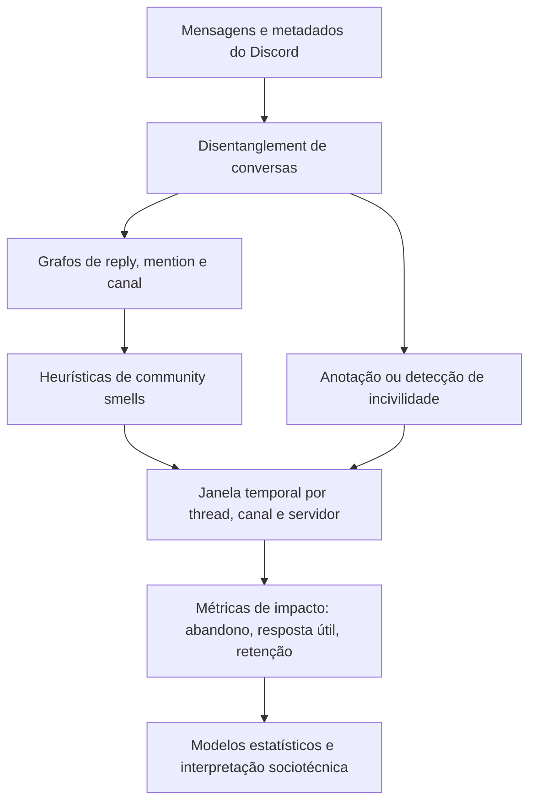

# Community smells na engenharia de software

## Resumo executivo

A literatura sobre **community smells** em engenharia de software ainda é relativamente pequena, mas já é suficientemente madura para sustentar um trabalho de mestrado forte, especialmente se a sua intenção é conectar **estrutura social/comunitária** a **incivilidade em servidores Discord**. No corpus inspecionado, a base mais sólida vem de quatro eixos: um estudo empírico de larga escala com detecção automática em comunidades OSS; um estudo misto que liga community smells à **persistência/intensidade de code smells**; uma versão curta em ICSE Companion que resume essa conexão; e uma **revisão sistemática da literatura** sobre community smells como fonte de social debt. Esses trabalhos convergem em três ideias: community smells são **antipadrões sociotécnicos**; eles afetam coordenação, comunicação, compartilhamento de conhecimento e desempenho coletivo; e sua presença está associada a custos de projeto e piora indireta de qualidade e manutenibilidade. fileciteturn1file0 fileciteturn1file1 fileciteturn1file2 fileciteturn1file3

A revisão sistemática mais abrangente no corpus recuperado, publicada em *Information and Software Technology*, identificou **25 estudos**, **30 community smells**, **11 propriedades comuns**, **8 tipos de causas** e **11 tipos de efeitos**, além de organizar as evidências em **cinco grupos de abordagens de gestão**: estratégias organizacionais, frameworks, modelos, ferramentas e guidelines. O próprio artigo ressalta que a literatura ainda é escassa e se concentra em um conjunto pequeno de smells, apesar de seus efeitos em pessoas, processos, produtos e organizações. Isso é importante para o seu mestrado porque sugere um espaço claro para ampliar a agenda em direção a **plataformas conversacionais modernas**, como Discord, que ainda não aparecem como foco principal da literatura nuclear de community smells. fileciteturn1file3

O estudo empírico automatizado mais central, baseado em **60 comunidades open source** e em **mais de 100 anos acumulados** de releases e estruturas de comunicação, mostrou que community smells são **altamente difusos** em projetos OSS. Os autores operacionalizaram quatro smells clássicos — **Organisational Silo**, **Black Cloud**, **Lone Wolf** e **Bottleneck** — e encontraram, em média, **25 community smells por comunidade por release**. Também observaram que desenvolvedores percebem esses smells como problemas reais para evolução das comunidades, e que fatores como **socio-technical congruence** se associam a menos smells. Essa é uma mensagem importante: community smells não são apenas metáfora interpretativa; eles já foram tratados como um **fenômeno observável, detectável e quantificável**. fileciteturn1file0

O trabalho “Beyond Technical Aspects” aprofunda o valor prático dessa linha ao mostrar que fatores comunitários ajudam a explicar a **intensidade de code smells**. Em um estudo misto com **117 releases de 9 sistemas OSS**, **32.889 commits**, **436 desenvolvedores** e uma survey com **162 desenvolvedores**, os autores concluem que fatores ligados à comunidade contribuem para a severidade dos code smells e que um modelo de predição enriquecido com community smells supera um modelo sem essa informação. A survey é especialmente forte: **mais de 80%** dos participantes mencionaram evitar problemas comunitários como motivo para **não** refatorar smells técnicos. Em termos de tese, isso cria uma ponte direta entre o “social” e o “técnico”: estruturas sociais ruins podem ajudar a explicar por que problemas de código persistem. fileciteturn1file1 fileciteturn1file2

Para o seu contexto específico, a melhor leitura é a seguinte: **incivilidade em Discord** pode ser tratada como um sinal conversacional de baixo nível, enquanto **community smells** podem ser tratados como estruturas e dinâmicas sociotécnicas de nível meso ou macro. Em outras palavras, a incivilidade seria o **evento discursivo**, e os community smells seriam o **padrão relacional** que ajuda a explicar por que esse evento aparece, se espalha e produz efeitos. Essa combinação ainda é uma lacuna clara na literatura. Com o que já existe, você pode propor uma agenda original: detectar smells em redes de reply/mention/canal do Discord e testar como esses smells se relacionam com rudeza, assédio, toxicidade, abandono de thread, queda de resposta útil e retenção de newcomers. Essa integração é uma inferência metodológica nova, mas é bem sustentada pelo corpus de community smells inspecionado. fileciteturn1file0 fileciteturn1file1 fileciteturn1file3

## Panorama conceitual e taxonomias

No corpus inspecionado, community smells são tratados como **antipadrões sociotécnicos** ou **circunstâncias organizacionais/subestruturas sociais subótimas** que podem gerar custo adicional de projeto e acumular **social debt**. A analogia explícita com **code smells** é importante: assim como code smells não “quebram” o sistema imediatamente, community smells não destroem automaticamente a comunidade, mas indicam condições que, ao longo do tempo, tendem a se manifestar como atraso, comunicação ruim, compartilhamento de conhecimento imperfeito, conflitos, fragilidade organizacional ou dificuldade de evolução. A revisão sistemática reforça esse enquadramento ao diferenciar community smells de code smells e architectural smells: os dois últimos focam mais os aspectos técnicos do software, enquanto community smells incluem os **aspectos sociais do trabalho de desenvolvimento**. fileciteturn1file0 fileciteturn1file3

Os quatro **smells canônicos** mais estáveis e detectáveis no corpus recuperado são os seguintes. **Organisational Silo** descreve subcomunidades que se comunicam pouco entre si, geralmente conectadas por um ou dois membros ponte. **Black Cloud** descreve sobrecarga de informação causada por comunicação recorrente, pouco estruturada ou mal governada. **Lone Wolf** descreve contribuidores isolados, muitas vezes com forte papel técnico, que atuam com pouca consideração por pares, decisões coletivas ou canais formais. **Bottleneck** ou **Radio Silence** descreve a situação em que uma única pessoa intermedeia quase toda a interação entre dois ou mais grupos, sem abertura para canais paralelos. Esses quatro smells aparecem tanto na formulação teórica quanto na operacionalização automática do estudo de larga escala. fileciteturn1file0

O estudo sobre code smells acrescenta um conjunto de **smells emergentes ou menos estabilizados** na literatura central disponível aqui. A versão curta do trabalho relata a ocorrência de **dois smells já conhecidos** e **quatro previamente desconhecidos** no contexto analisado. Os quatro traços adicionais mencionados no texto disponível podem ser organizados como: **incapacidade de atingir consenso**, **medo de que a refatoração prejudique a compreensibilidade**, **classes altamente complexas gerenciáveis por apenas 1–2 pessoas** e **mudanças que fragmentam uma colaboração antes modularizada**. O texto acessível não padroniza necessariamente esses quatro itens como nomes finais universalmente aceitos de community smells; por isso, o melhor é tratá-los como **padrões comunitários emergentes** identificados empiricamente naquele estudo, e não como taxonomia fechada do campo. fileciteturn1file1 fileciteturn1file2

A revisão sistemática amplia bastante o universo conceitual ao afirmar que a literatura já menciona **30 community smells** e **11 propriedades comuns**, mas os trechos acessíveis aqui não enumeram integralmente os nomes dos 30 smells nem a lista completa das 11 propriedades. Assim, para um relatório rigoroso, o mais correto é registrar que a SLR **estabelece a existência dessa taxonomia ampliada**, mas que a enumeração exata de todos os itens permanece **unspecified** no material textual disponível nesta sessão. Ainda assim, a SLR deixa clara a utilidade de organizar os smells por **causas, efeitos, estágios de evolução e impacto em teamwork**, em vez de tratá-los apenas como lista plana de nomes. fileciteturn1file3

Para uso prático no seu mestrado, uma taxonomia operacional mais útil do que a taxonomia puramente nominal é agrupar community smells em **categorias analíticas**. A tabela abaixo resume essa reorganização, ancorada no corpus acessível e já pensada para integração com análise de incivilidade em Discord.

| Categoria analítica | Smells/padrões associados | Manifestação típica em SE | Relevância para incivilidade/Discord |
|---|---|---|---|
| Fragmentação estrutural | Organisational Silo | Subgrupos pouco conectados; comunicação atravessa poucas pontes | Aumenta mal-entendidos entre canais/grupos e pode intensificar respostas hostis intergrupais |
| Sobrecarga comunicacional | Black Cloud | Fluxo excessivo, repetitivo e mal governado de mensagens/discussões | Pode elevar impaciência, rudeza e perda de contexto em chats |
| Hipercentralização individual | Bottleneck / Radio Silence | Um ator concentra mediação entre grupos ou decisões | Discussões críticas ficam vulneráveis ao estilo relacional desse ator |
| Isolamento especializado | Lone Wolf | Especialista trabalha e decide com pouca reciprocidade social | Pode coexistir com condescendência, gatekeeping e baixa acolhida a newcomers |
| Falha de governança/consenso | Incapacidade de atingir consenso | Refatorações ou mudanças travam por desacordo persistente | Conversas longas, conflituosas e sem fechamento tendem a escalar verbalmente |
| Fragilidade de compreensibilidade e dependência de poucos | Complexidade gerida por 1–2 pessoas; medo de refatorar | Conhecimento concentrado bloqueia manutenção coletiva | Pode gerar frustração, respostas ríspidas e exclusão de participantes menos experientes |
| Fragmentação de colaboração | Ruptura de colaboração antes modularizada | Reorganizações ou mudanças causam perda de coesão entre grupos | Relevante para detectar degradação social após conflito ou moderação |

Os agrupamentos acima são inferências analíticas a partir dos trabalhos inspecionados, e não uma taxonomia oficial única da literatura. Eles são úteis porque conectam a camada estrutural de community smells à camada discursiva de incivilidade. fileciteturn1file0 fileciteturn1file1 fileciteturn1file2 fileciteturn1file3

## Evidências empíricas sobre qualidade, manutenção, produtividade e rotatividade

O estudo automatizado em comunidades OSS é a melhor evidência disponível no corpus para a **difusão** e **percepção** de community smells em escala. Os autores analisaram dados de releases e estruturas de comunicação/collaboration equivalentes a **mais de 100 anos** agregados de histórico sobre **60 comunidades open source**, avaliaram a presença dos quatro smells canônicos e observaram média de **25 community smells por comunidade, por release**. Também reportaram entrevista com **35 desenvolvedores de 11 comunidades** e survey em “smelly communities”, concluindo que os efeitos negativos são percebidos pelos próprios participantes. Um resultado relevante para estudos futuros é que **socio-technical congruence** se associou a menor número de smells, enquanto outros fatores, como distância, não mostraram correlação clara com a emergência de smells no recorte estudado. fileciteturn1file0

Esse mesmo estudo é importante porque liga community smells a consequências organizacionais concretas, ainda que nem sempre por meio de inferência causal fechada. Os autores enquadram esses smells como precursores de problemas como **delays recorrentes na comunicação**, **wrongful/imperfect knowledge sharing**, **rage-quitting** e até **sudden, collective employee turnover** como motivação do problema de pesquisa. Eles também indicam que alguns smells, especialmente o **Black Cloud**, aparecem menos frequentemente, mas tendem a ocorrer mais em comunidades com mais de **50 participantes**, o que ajuda a pensar a escalabilidade do problema em plataformas conversacionais maiores. Para uma pesquisa em Discord, esse ponto é especialmente útil porque sugere que **volume e tamanho da comunidade** não são apenas covariáveis neutras: podem ser parte da estrutura geradora do smell. fileciteturn1file0

O trabalho “Beyond Technical Aspects” oferece a evidência mais forte de ligação entre community smells e **qualidade/manutenibilidade** do software. O estudo foi conduzido sobre **117 releases** de **9 sistemas OSS** de dois ecossistemas, Apache e Eclipse, com **32.889 commits**, **436 desenvolvedores** e code smells detectados automaticamente com o DECOR. Na vertente qualitativa, os autores contataram **472 desenvolvedores** e obtiveram **162 respostas**, com taxa de resposta de **34,32%**. O achado central é particularmente forte para a literatura de manutenção: **mais de 80%** dos praticantes mencionaram explicitamente evitar problemas comunitários como razão para não remover code smells. Em termos práticos, os autores resumem a consequência assim: às vezes é “mais conveniente manter um technical smell do que lidar com um community smell”. fileciteturn1file1 fileciteturn1file2

Na vertente quantitativa, o mesmo trabalho sustenta que community smells **ajudam a explicar o aumento de intensidade de code smells** e que um modelo de predição com fatores comunitários supera um modelo que considera só informações técnicas. Isso desloca a discussão: community smells não são apenas “problemas de clima”; eles se tornam variáveis relevantes para explicar **persistência e severidade de problemas estruturais de código**. A versão resumida do artigo mostra inclusive que, em certas classes de code smells, métricas diretamente ligadas a community smells ou fatores comunitários — como **Organizational Silo**, **Black Cloud**, **Lone Wolf**, **Bottleneck**, **ST-Congruence**, **Smelly Quitters**, **Turnover**, **Truck Factor** e **Core-Periphery Ratio** — aparecem entre as features com maior ganho explicativo. fileciteturn1file1 fileciteturn1file2

A relação com **produtividade** aparece, no corpus disponível, mais como uma cadeia de mecanismos do que como um único efeito causal mensurado ponta a ponta. Community smells geram custo adicional, stressam comunicação e coordenação, reduzem a qualidade do compartilhamento de conhecimento e dificultam ou desincentivam refatorações necessárias. O efeito final observado diretamente nos estudos é sobretudo sobre **manutenção**, **persistência de code smells** e **saúde da comunidade**, mais do que sobre uma métrica única de produtividade industrial. Para o seu mestrado, isso é uma vantagem: você pode atuar exatamente nessa lacuna e medir efeitos intermediários em Discord, como **time-to-first-response**, **thread abandonment**, **drop de interação após conflito** e **retenção de newcomers**. O material disponível sustenta fortemente a hipótese de que community smells afetam o trabalho; o que ainda falta é o elo específico com plataformas de chat contemporâneas. fileciteturn1file0 fileciteturn1file3

## Métodos automáticos, heurísticas, ferramentas e datasets

O principal marco de **detecção automática** no corpus inspecionado é o trabalho que introduz **CODEFACE4SMELLS**, uma extensão open source do toolchain **CODEFACE** para identificar automaticamente quatro community smells: Organisational Silo, Black Cloud, Lone Wolf e Bottleneck. O estudo apresenta community smells como **motifs** ou **subestruturas recorrentes** em grafos organizacionais/sociotécnicos, aproximando o problema de técnicas de análise de redes sociais e de grafos de comunicação/colaboração. A informação acessível indica que a abordagem trabalha sobre **estruturas organizacionais e de comunicação** extraídas de fontes como issues, mailing lists e dados similares de comunidades OSS. As fórmulas exatas, thresholds e detalhes completos da implementação não aparecem integralmente no trecho acessível aqui; portanto, esses aspectos devem ser marcados como **unspecified** se você ainda não tiver extraído o artigo completo localmente. fileciteturn1file0

Mesmo sem todos os thresholds, o artigo permite reconstruir o núcleo heurístico de cada smell. **Organisational Silo** é identificado quando há **áreas isoladas da comunidade** que quase não se comunicam, exceto por uma ou duas pessoas. **Black Cloud** aparece como **sobrecarga informacional** por comunicação recorrente e falta de governança cooperativa. **Lone Wolf** corresponde a atores que contribuem de forma isolada, “unsanctioned or defiant”, com baixa consideração pelos pares e decisões coletivas. **Bottleneck/Radio Silence** é modelado como um caso de **unique boundary spanner**: uma pessoa que se interpõe em toda interação formal entre subcomunidades, com pouca flexibilidade para canais paralelos. Isso já é suficiente para uma adaptação ao Discord, porque essas definições são naturalmente traduzíveis em termos de **reply graphs**, **mention graphs**, **canais** e **centralidade**. fileciteturn1file0

O segundo bloco metodológico forte do corpus vem do estudo sobre code smell intensity. Ali, a detecção de code smells foi feita com o **DECOR**, usando regras explícitas (“rule cards”) que capturam características intrínsecas de smells como **Long Method**, **Feature Envy**, **Blob Class**, **Spaghetti Code** e **Misplaced Class**. O valor desse trabalho para community smells está menos na detecção em si e mais na engenharia de features. A tabela resumida no artigo curto mostra uma combinação explícita de **features técnicas** e **features sociais/comunitárias**, como **LOC**, **Churn**, **CBO**, **Clones**, **Previous Intensity**, **Committers**, **Project Tenure**, **Turnover**, **Truck Factor**, **Ratio Core-Periphery** e smells comunitários específicos. Em outras palavras, a pesquisa já sugere um desenho de modelagem híbrida: variáveis de estrutura comunitária e de código entram juntas para explicar resultado técnico. fileciteturn1file1 fileciteturn1file2

Esse desenho híbrido é exatamente o que interessa se você quiser integrar community smells à análise de **incivilidade no Discord**. Em vez de treinar apenas um classificador de linguagem tóxica, você pode construir um pipeline em duas camadas. A primeira camada modela a **rede e a ecologia da comunidade**: centralidade, modularidade, reciprocidade, bridging, distribuição de atividade, diversidade de canais, persistência de threads, concentração de conhecimento. A segunda modela o **conteúdo linguístico**: rudeza, impaciência, sarcasmo, entitlement, insulto, gatekeeping e assédio. A inovação da dissertação viria justamente de testar se community smells ajudam a explicar **onde** e **quando** incivilidade emerge, e **quais efeitos** ela produz. Essa é uma extrapolação metodológica nova, mas alinhada com o quadro empírico já estabelecido pelos artigos do corpus. fileciteturn1file0 fileciteturn1file1

A revisão sistemática de 2023 também é útil para métodos porque organiza a literatura em **cinco grupos de abordagens de gestão**: **estratégias organizacionais**, **frameworks**, **modelos**, **ferramentas** e **guidelines**. Isso sugere que, para um mestrado, não vale limitar a discussão a classificação algorítmica. Um design mais forte é posicionar o seu trabalho como uma contribuição em dois níveis: **(i)** método de detecção/quantificação e **(ii)** instrumento de governança comunitária. Em outras palavras, você não estaria apenas medindo community smells, mas oferecendo uma base para monitorar saúde comunitária em Discord. fileciteturn1file3

A tabela abaixo resume os recursos, métodos e artefatos mais relevantes do corpus acessível.

| Recurso / estudo | Tipo | Fonte / venue | O que oferece | Disponibilidade pública |
|---|---|---|---|---|
| CODEFACE4SMELLS | Ferramenta / extensão | Estudo automatizado em IEEE TSE | Detecção automática de 4 community smells sobre estruturas sociais/técnicas | O artigo afirma que a extensão é open source; URL específica **unspecified** no material acessível fileciteturn1file0 |
| CODEFACE | Ferramenta-base de análise sociotécnica | Citada como base do CODEFACE4SMELLS | Construção e análise de estruturas organizacionais/comunidades | URL específica **unspecified** no material acessível fileciteturn1file0 |
| DECOR | Ferramenta de code smell detection | Usada em estudo TSE sobre intensidade de code smells | Detecta Long Method, Feature Envy, Blob, Spaghetti Code, Misplaced Class | Regras (“rule cards”) citadas com URL do projeto PTIDEJ: `http://www.ptidej.net/research/designsmells/` fileciteturn1file1 |
| Replication package do estudo de intensidade | Dataset / package | Estudo “Beyond Technical Aspects” | Dados qualitativos e quantitativos anonimizados | O artigo afirma existência de comprehensive replication package; URL específica **unspecified** no trecho acessível fileciteturn1file1 |
| SLR de community smells | Revisão sistemática | *Information and Software Technology* | Taxonomia ampliada, causas, efeitos, abordagens de gestão, framework de estágios | Artigo primário com DOI conhecido e acessível fileciteturn1file3 |

## Como integrar community smells à análise de incivilidade no Discord

Para a sua dissertação, o uso mais promissor de community smells é tratá-los como **contexto estrutural** para interpretar incivilidade. Em chats como Discord, a unidade “mensagem tóxica” raramente explica, sozinha, a deterioração comunitária. O que tende a importar é a combinação entre **estrutura de interação**, **governança**, **concentração de poder**, **sobrecarga comunicacional** e **evento discursivo**. É exatamente aí que community smells entram: eles oferecem uma linguagem teórica e operacionalizável para ligar aquilo que aparece no texto ao que está “por trás” dele na rede social da comunidade. Essa integração não está pronta na literatura nuclear recuperada aqui; portanto, ela constitui uma contribuição original plausível para mestrado e publicação. fileciteturn1file0 fileciteturn1file3

A recomendação metodológica principal é construir um **grafo multiplex temporal** a partir do Discord. Uma camada representa **replies e mentions** entre usuários. Outra representa **co-participação em canais**. Uma terceira liga usuários a **artefatos técnicos** quando mensagens referenciam repositórios, issues, PRs, commits, documentação ou snippets. Sobre essas camadas, você pode calcular janelas móveis de smell. Um **Organisational Silo** pode aparecer como alta modularidade com baixa reciprocidade entre grupos. Um **Black Cloud** pode ser aproximado por bursts longos de mensagens, alta repetição sem resolução e queda de clareza ou fechamento. Um **Lone Wolf** pode ser modelado como alto expertise aparente combinado com baixa reciprocidade e baixo compartilhamento de coordenação. Um **Bottleneck** pode ser estimado por betweenness centrality extrema associada a canais ou tópicos críticos. Esses mapeamentos são inferências metodológicas coerentes com o corpus disponível. fileciteturn1file0

O passo seguinte é cruzar esses sinais estruturais com **rótulos de incivilidade**. Em vez de perguntar apenas “há toxicidade?”, a pergunta passa a ser: **em que tipo de smell a incivilidade aparece com mais probabilidade?**; **ela se espalha mais em contextos de Black Cloud?**; **há mais rudeza dirigida a newcomers em padrões Lone Wolf ou Bottleneck?**; **threads incivis em áreas siloed morrem mais rápido ou recebem menos resposta útil?**. Esse desenho torna a dissertação mais forte do que um trabalho apenas de NLP, porque permite propor mecanismos e não apenas correlações superficiais. O corpus atual sobre community smells não responde isso diretamente, mas oferece base sólida para formular as hipóteses. fileciteturn1file0 fileciteturn1file1

Uma agenda de hipóteses viável para o mestrado seria a seguinte. Em comunidades com sinais mais fortes de **Black Cloud**, a probabilidade de mensagens impacientes, dismissive ou rude aumenta. Em contextos **Bottleneck**, a incivilidade de poucos atores centrais tem maior efeito comunitário por concentrar poder relacional. Em estruturas **Lone Wolf**, newcomers expostos a respostas ríspidas ou condescendentes tendem a apresentar menor retorno futuro. Em contextos **Organisational Silo**, conflitos intergrupo aparecem mais como mal-entendido, falta de contexto e respostas atravessadas do que como insulto explícito. Essas hipóteses são novas, mas compatíveis com o que os trabalhos sobre community smells já indicam sobre comunicação, coordenação e social debt. fileciteturn1file0 fileciteturn1file3

O fluxo abaixo resume um pipeline conceitual adequado para essa integração.

Em termos de publicação, isso abre um caminho muito bom. Um primeiro paper pode ser orientado a **MSR** ou **ICPC**, com foco em extração, modelagem de rede, adaptação de smells ao Discord e reprodutibilidade. Um segundo paper, mais analítico, pode mirar **EMSE**, **JSS**, **FSE**, **ICSE-SEIS** ou **CSCW**, enfatizando a ligação entre smells, incivilidade e resultados colaborativos. O corpus atual já sustenta bem o enquadramento teórico; o valor novo virá do dado de Discord e da ponte com incivilidade. fileciteturn1file0 fileciteturn1file1 fileciteturn1file3

## Tabelas comparativas e agenda de pesquisa

A tabela abaixo prioriza os estudos mais relevantes recuperados diretamente no material inspecionado para o seu objetivo de integrar community smells à investigação de incivilidade em Discord.

| Referência | Ano | Venue | Método | Dataset / tamanho | Principais achados | Relevância para incivilidade / Discord |
|---|---:|---|---|---|---|---|
| Tamburri, Palomba, Kazman, *Exploring Community Smells in Open-Source: An Automated Approach* | 2017 no arquivo; detalhes finais de publicação **unspecified** | IEEE TSE | Detecção automática + estudo empírico + survey/entrevistas | 60 comunidades OSS; >100 anos agregados de releases e estruturas de comunicação; 35 desenvolvedores de 11 comunidades entrevistados | Define e operacionaliza 4 smells; média de 25 smells por comunidade por release; ST congruence se associa a menos smells | Base mais forte para tradução de community smells em métricas sobre Discord fileciteturn1file0 |
| Palomba et al., *How Do Community Smells Influence Code Smells?* | 2018 | ICSE Companion | Mixed methods resumido | 117 releases; 9 sistemas OSS; 162 desenvolvedores | >80% citam problemas comunitários como motivo para não refatorar code smells; community-aware model supera baseline | Mostra ponte direta entre estrutura comunitária e consequências técnicas; útil para defender impacto sobre desenvolvimento fileciteturn1file2 |
| Palomba et al., *Beyond Technical Aspects: How Do Community Smells Influence the Intensity of Code Smells?* | Ano/volume **unspecified** no trecho acessível | IEEE TSE | Estudo misto aprofundado | 117 releases; 9 projetos; 32.889 commits; 436 devs; 162 respostas; 4.267 instâncias de code smell | Community-related factors contribuem para intensidade de code smells; modelo preditivo com fatores comunitários é mais preciso | Referência central para conectar smells a manutenção, severidade técnica e engenharia de features híbridas fileciteturn1file1 |
| Caballero-Espinosa, Carver, Stowers, *Community smells—The sources of social debt: A systematic literature review* | 2023 | Information and Software Technology | SLR | 25 estudos | Identifica 30 smells, 11 propriedades, 8 causas, 11 efeitos e 5 grupos de abordagens de gestão | Melhor fonte para enquadrar lacunas, taxonomia ampliada e agenda de pesquisa fileciteturn1file3 |

A partir desse estado da arte, as **lacunas de pesquisa** mais importantes para o seu mestrado ficam bastante nítidas. A primeira é a ausência de estudos centrais de community smells em **plataformas de chat modernas**, principalmente Discord. A segunda é que a literatura mostra ligação entre community smells e **qualidade/manutenção**, mas ainda tem pouca evidência fina sobre como smells afetam **microdesfechos de interação**, como abandono de discussão, queda de reciprocidade ou deterioração do suporte a newcomers em ambientes síncronos. A terceira é a falta de uma ponte explícita entre **community smells** e **incivilidade**; embora o conceito de social debt e os efeitos em teamwork apontem nessa direção, os trabalhos centrais ainda não tratam a incivilidade como variável principal. A quarta é metodológica: mesmo quando há detecção automática, os estudos acessíveis se concentram em **quatro smells canônicos**, enquanto a SLR afirma a existência de um universo muito maior de smells pouco explorados. fileciteturn1file0 fileciteturn1file3

Para o seu mestrado, a recomendação mais estratégica é começar pelos **quatro smells canônicos** e acrescentar, no máximo, **duas extensões contextuais** particularmente relevantes para Discord: **falha de consenso** e **fragmentação de colaboração**. Isso reduz risco teórico e facilita operacionalização. Depois, use incivilidade como uma camada adicional, não substitutiva: community smells explicam **estrutura e contexto**, enquanto incivilidade explica **evento textual e escalada discursiva**. Essa combinação tem excelente potencial de contribuição original e, ao mesmo tempo, permanece ancorada no melhor que a literatura de community smells já consolidou. fileciteturn1file0 fileciteturn1file1 fileciteturn1file3

## Referências prioritárias

As referências abaixo são as de **maior confiança** porque foram recuperadas diretamente do corpus inspecionado nesta sessão. Quando algum metadado final não apareceu de forma íntegra no material acessível, ele foi marcado como **unspecified**.

**Caballero-Espinosa, E.; Carver, J. C.; Stowers, K.** *Community smells—The sources of social debt: A systematic literature review*. **Information and Software Technology**, 153, 107078, 2023. DOI: **10.1016/j.infsof.2022.107078**.  
Resumo: a principal revisão sistemática do corpus acessível. Organiza 25 estudos, 30 smells, 11 propriedades, 8 tipos de causas, 11 tipos de efeitos e 5 grupos de estratégias de gestão. É a melhor fonte para fundamentação teórica, lacunas e desenho do estado da arte. fileciteturn1file3

**Tamburri, D. A.; Palomba, F.; Kazman, R.** *Exploring Community Smells in Open-Source: An Automated Approach*. **IEEE Transactions on Software Engineering**, ano final de publicação **unspecified** no trecho acessível; o arquivo mostra versão datada de 2017. DOI/URL final: **unspecified** no material textual disponível nesta sessão.  
Resumo: estudo central de detecção automática de community smells. Introduz CODEFACE4SMELLS, operacionaliza quatro smells canônicos e os avalia em 60 comunidades OSS. Melhor fonte para conceituação operacional e métricas estruturais. fileciteturn1file0

**Palomba, F.; Tamburri, D. A.; Serebrenik, A.; Zaidman, A.; Arcelli Fontana, F.; Oliveto, R.** *How Do Community Smells Influence Code Smells?* In: **ICSE ’18 Companion: 40th International Conference on Software Engineering Companion**, 2018. DOI: **10.1145/3183440.3194950**.  
Resumo: versão curta, muito útil para síntese rápida. Mostra a conexão entre community smells e persistência/intensidade de code smells e relata os quatro padrões comunitários emergentes encontrados na análise qualitativa. fileciteturn1file2

**Palomba, F.; Tamburri, D. A.; Arcelli Fontana, F.; Oliveto, R.; Zaidman, A.; Serebrenik, A.** *Beyond Technical Aspects: How Do Community Smells Influence the Intensity of Code Smells?* **IEEE Transactions on Software Engineering**, ano/volume/paginação **unspecified** no trecho acessível. DOI/URL final: **unspecified** no material textual disponível nesta sessão.  
Resumo: estudo misto aprofundado que mostra empiricamente que fatores comunitários ajudam a explicar a intensidade de code smells e que um modelo community-aware supera um modelo sem fatores sociais. É provavelmente a melhor referência para justificar integração entre métricas sociais e problemas técnicos. fileciteturn1file1

**DECOR / PTIDEJ rule cards**. URL citada no paper: `http://www.ptidej.net/research/designsmells/`.  
Resumo: não é um estudo de community smells, mas é a ferramenta usada para detectar code smells no estudo de intensidade. Vale a pena citá-la na metodologia se você quiser reproduzir o elo “community smells → code smells”. fileciteturn1file1

No corpus inspecionado, não apareceram **fontes primárias em português** entre os trabalhos centrais; a literatura nuclear está em inglês. Também permanecem **unspecified** no material acessível desta sessão: a lista nominal completa dos **30 smells** da SLR, a enumeração integral das **11 propriedades comuns**, os nomes padronizados finais dos **quatro smells adicionais** encontrados no estudo sobre code smells, e os URLs finais de alguns repositórios/replication packages citados pelos autores. Ainda assim, o conjunto disponível já é suficiente para sustentar uma fundamentação forte, uma taxonomia operacional e uma agenda original para conectar **community smells** à **incivilidade em comunidades de engenharia de software no Discord**. fileciteturn1file1 fileciteturn1file2 fileciteturn1file3